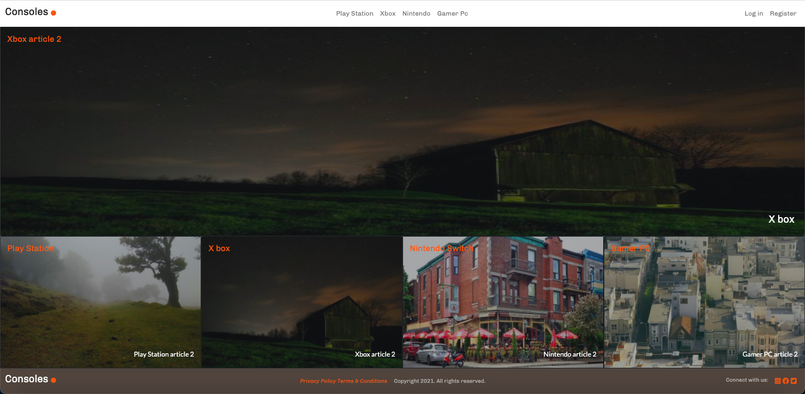

# Consoles article page

> This repo includes code for an article of game consoles app with log in capabilities, as well as add new articles with images and a voting system. The Consoles logo takes you to the home page where you can find the big image of the most voted article, under it you will find the 4 cateogies with the last article created as background. In the navbar you will find the 4 categories and either log in or sign in if you are not loged in, as son as you are loged in the navbar will display a full list of articles, a link to create a new article and as well your menu to edit your account or sign out. on the view of each particular article you can create a comment that will be displayed with time and user wich will be the begining of the email.



## Built With

- Ruby v2.7.2
- Ruby on Rails v6.1.3.2

## Live Demo

https://railsconsoles.herokuapp.com/

## Getting Started

To get a local copy up and running follow these simple example steps.

### Prerequisites

Ruby: 2.7.2
Rails: 5.2.3
Postgres: >=9.5

### Setup

Instal gems with:

```
bundle install
```

Setup database with:

```
rails db:{create,migrate,seed}
```

### Github Actions

To make sure the linters' checks using Github Actions work properly, you should follow the next steps:

1. On your recently forked repo, enable the GitHub Actions in the Actions tab.
2. Create the `feature/branch` and push.
3. Start working on your milestone as usual.
4. Open a PR from the `feature/branch` when your work is done.

### Usage

Start server with:

```
rails s
```

Open `http://localhost:3000/` in your browser.

### Run tests

```
rspec spec
```

## Author

👤 **Andres Felipe Castañeda Ramos**

- Github: [@afcastaneda223](https://github.com/afcastaneda223)
- Twitter: [@afcastaneda](https://twitter.com/afcastaneda)
- Linkedin: [Andres Felipe Castañeda](www.linkedin.com/in/andres-castaneda223)

## 🤝 Contributing

Contributions, issues and feature requests are welcome!

Feel free to check the [issues page](issues/).

## Show your support

Give a ⭐️ if you like this project!

## Acknowledgments

- Microverse
- Special thanks to Nelson Sakwa [https://www.behance.net/sakwadesignstudio]
- Design idea by [Nelson Sakwa and others on Behance](https://www.behance.net/sakwadesignstudio) info (layouts) follow in this link [https://www.behance.net/gallery/14554909/liFEsTlye-Mobile-version]

## 📝 License

Distributed by the Creative Commons Legal Code. See `LICENSE` for more information.
